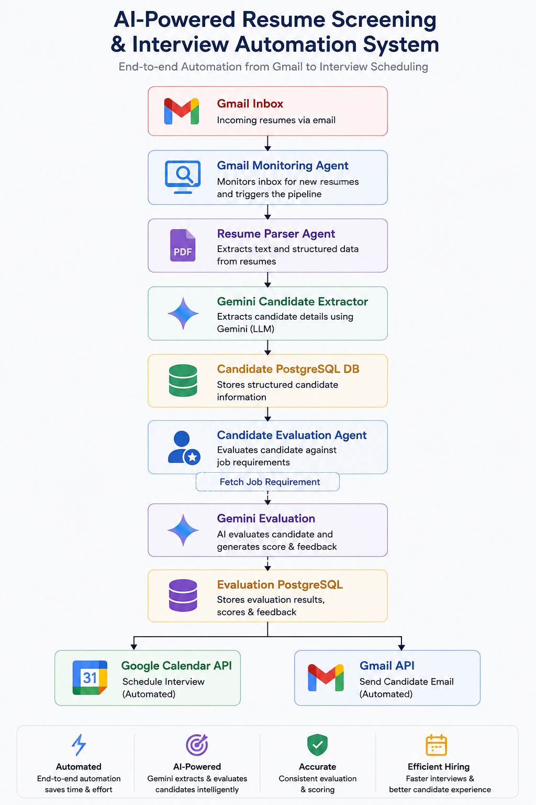

# 🤖 AI Recruiter Agent

An AI-powered recruitment automation system built with **FastAPI**, **Google Gemini**, **PostgreSQL**, **Gmail API**, and **Google Calendar API**.

The system automatically monitors incoming resumes from Gmail, extracts candidate information using AI, evaluates candidates against job requirements, stores results in PostgreSQL, schedules interviews for qualified candidates, and sends recruitment emails.

---

# 🚀 Features

- 📧 Gmail Resume Monitoring
- 📄 Automatic Resume Parsing (PDF & DOCX)
- 🤖 AI Candidate Information Extraction using Gemini
- 🧠 AI Candidate Evaluation
- 🗄 PostgreSQL Candidate Management
- 💼 Job Requirement Management API
- 📅 Google Calendar Interview Scheduling
- ✉️ Automated Candidate Email Notifications
- ⏰ APScheduler Background Resume Monitoring
- ⚡ FastAPI REST API
- 🔍 Structured Candidate & Evaluation Storage

---

# 🏗 System Architecture


<p align="center">
  
</p>


---

# 📁 Project Structure

```
app/
│
├── agents/
│   └── supervisor.py
│
├── api/
│   └── jobs.py
│
├── core/
│   ├── config.py
│   └── gemini.py
│
├── models/
│   ├── db.py
│   ├── memory.py
│   └── model.py
│
├── repository/
│   └── recruitment_repository.py
│
├── scheduler/
│   └── gmail_scheduler.py
│
├── schema/
│   ├── candidate.py
│   ├── evaluation.py
│   └── job.py
│
├── tools/
│   ├── gmail_monitor.py
│   ├── resume_parser.py
│   ├── gemini_evaluation.py
│   ├── candidate_evaluate.py
│   ├── calendar.py
│   └── send_email.py
│
└── main.py
```

---

# ⚙️ Technologies Used

- Python 3.13+
- FastAPI
- SQLModel
- PostgreSQL
- Google Gemini API
- Gmail API
- Google Calendar API
- APScheduler
- PyMuPDF
- python-docx
- Pydantic

---

# 🔄 Workflow

## Step 1

Scheduler checks Gmail every 2 minutes.

↓

## Step 2

Downloads newly received resumes.

↓

## Step 3

Extracts text from:

- PDF
- DOCX

↓

## Step 4

Gemini extracts:

- Candidate Name
- Email
- Phone
- Skills
- Experience
- Education
- Certifications
- Projects
- LinkedIn
- GitHub

↓

## Step 5

Candidate is saved into PostgreSQL.

↓

## Step 6

Job Requirement is fetched.

↓

## Step 7

Gemini evaluates the candidate.

↓

## Step 8

Evaluation is stored.

↓

## Step 9

If score ≥ configured threshold:

- Schedule interview
- Send interview email

Otherwise:

- Send Hold / Reject email

---

# 📊 Candidate Evaluation Output

Gemini returns:

```json
{
  "overall_score": 91,
  "recommendation": "Interview",
  "matched_skills": [
    "Python",
    "FastAPI",
    "PostgreSQL"
  ],
  "missing_skills": [
    "AWS"
  ],
  "strengths": [
    "Strong backend development",
    "Excellent AI projects"
  ],
  "weaknesses": [
    "Limited cloud experience"
  ],
  "interview_questions": [
    "...",
    "...",
    "...",
    "...",
    "..."
  ]
}
```

---

# 📦 Installation

Clone repository

```bash
git clone https://github.com/yourusername/ai-recruiter-agent.git
```

Create virtual environment

```bash
python -m venv .venv
```

Activate

Windows

```bash
.venv\Scripts\activate
```

Linux

```bash
source .venv/bin/activate
```

Install dependencies

```bash
pip install -r requirements.txt
```

---

# 🔑 Environment Variables

Create `.env`

```env
DATABASE_URL=

GEMINI_API_KEY=

GMAIL_CLIENT_SECRET=

GOOGLE_CALENDAR_CREDENTIALS=
```

---

# ▶️ Run

```bash
uvicorn main:app --reload
```

Swagger

```
http://127.0.0.1:8000/docs
```

---

# 📡 API

## Jobs

```
POST /jobs
```

Create Job Requirement

---

```
GET /jobs
```

List Jobs

---

```
GET /jobs/{id}
```

Get Job

---

```
PUT /jobs/{id}
```

Update Job

---

```
DELETE /jobs/{id}
```

Delete Job

---

# 💾 Database

## Candidate

- Name
- Email
- Phone
- Resume Path
- Created Time

---

## Job Requirement

- Title
- Required Skills
- Preferred Skills
- Experience
- Education

---

## Evaluation

- Candidate ID
- Job ID
- Overall Score
- Recommendation
- Strengths
- Weaknesses

---

# 🔮 Future Improvements

- Multi-job matching
- Resume semantic search using Qdrant
- Duplicate resume detection
- Interview feedback agent
- Salary prediction
- AI interviewer
- WhatsApp & Slack notifications
- Dashboard with analytics
- Multi-agent orchestration using LangGraph
- Resume ranking
- Candidate embeddings
- OCR support for scanned resumes

---

# 👨‍💻 Author

**Shazil Ali**

AI Engineer | FastAPI | AI Agents | PostgreSQL | Gemini | Kubernetes | AWS

---

# ⭐ Support

If you found this project helpful, consider giving it a ⭐ on GitHub.
